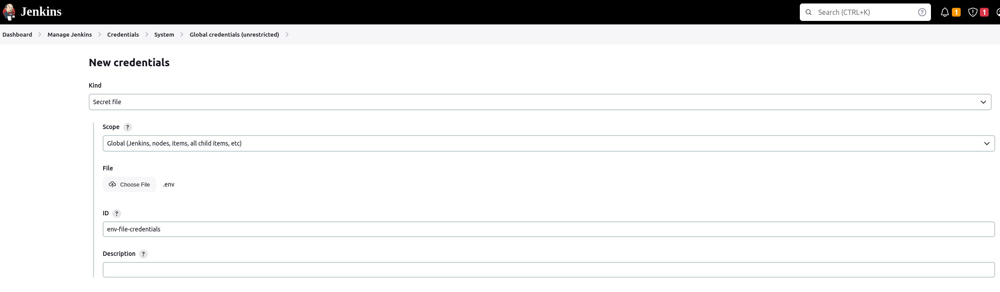
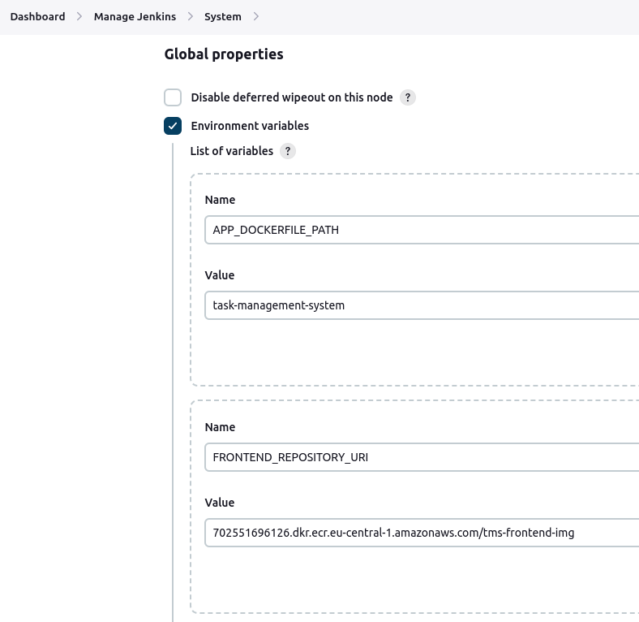
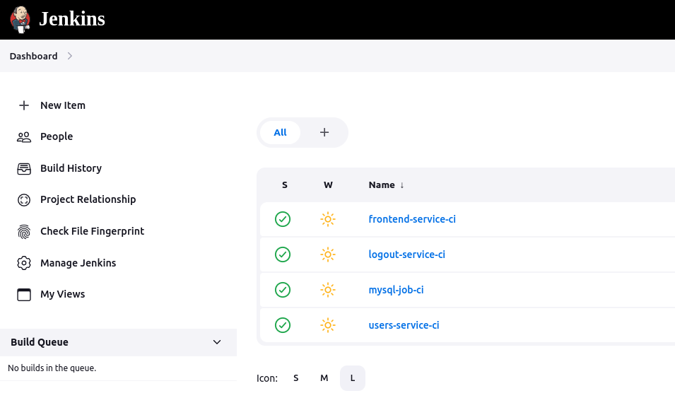
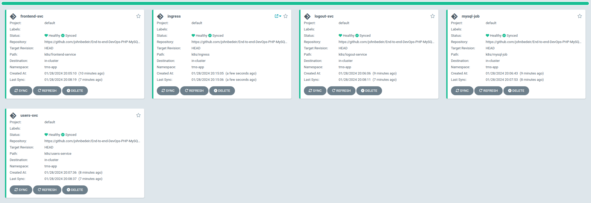

# End to End DevOps Project - PHP & MySQL

This project demonstrates an end-to-end setup for a PHP and MySQL application, leveraging Apache2 as the web server. Follow these instructions to run the application locally on your Linux machine.

## Prerequisites

Before you begin, ensure you have the following installed on your Linux machine:

- Apache2
- PHP 8.2
- MySQL
- Composer

## 1. Running the Application Locally

### Step 1: Install Composer

Download and install Composer globally:

```bash
curl -sS https://getcomposer.org/installer | php
mv composer.phar /usr/local/bin/composer
```

### Step 2: Initialize Composer

Navigate to your project directory and initialize Composer:

```bash
cd task-management-system
composer init
```

### Step 3: Install Dependencies

Install the necessary PHP packages:

```bash
composer install
composer require vlucas/phpdotenv
```

### Step 4: Install Apache

Install Apache2:

```bash
sudo apt install apache2
```

### Step 5: Install PHP with MySQL Support

Install PHP 8.2 along with the required modules:

```bash
sudo apt-get install php8.2 php8.2-mysql php8.2-cli php8.2-common
sudo apt-get install php-mysql
sudo a2enmod php8.2
sudo systemctl restart apache2
```

## Running the Application

After completing the setup, place your PHP project files in the appropriate Apache directory (commonly `/var/www/html`). Then, navigate to `localhost` or the respective IP address in your web browser to view your application.

## Troubleshooting

If you encounter any issues, ensure that:

- All services (Apache2, MySQL) are running.
- PHP version compatibility is checked.
- File permissions are set correctly in the Apache directory.

## For detailed logs, check Apache's error log usually located at `/var/log/apache2/error.log`.

## 2. Running the Application using Docker Compose

This project is configured to run as a set of microservices using Docker Compose, which includes services for the frontend, user management (login, registration, and dashboard), a logout service, and a MySQL database. An Nginx service is used as a reverse proxy to route requests to the appropriate microservice based on the URL path.

### Prerequisites

- Docker
- Docker Compose

### Build and Start the Services:

Use Docker Compose to build and start the services. This might take some time initially as Docker needs to build the images for each service.

```bash
docker-compose up --build
```

The --build flag ensures that Docker Compose builds the images before starting the containers.

### Accessing the Application:

Once all services are up and running, you can access the application by opening a web browser and navigating to:

```
http://localhost
```

This will take you to the frontend service. The Nginx reverse proxy routes requests to the appropriate microservice based on the URL path:

- `/` routes to the frontend service.
- `/pages/login` routes to the user login page provided by the users-service.
- `/pages/register` routes to the user registration page provided by the users-service.
- `/pages/logout` routes to the logout service.
- `/pages/dashboard` routes to the user dashboard provided by the users-service.

```
http {
    server {
        listen 80;

        location / {
            proxy_pass http://frontend:80/;
        }

        location /pages/login {
            proxy_pass http://users-service:80;
        }
...................................................................
```

## 3. Deploying the Application on Minikube

This guide will walk you through the process of deploying the application on Minikube, including the frontend, logout and users-services, database, and Ingress for routing external traffic.

### Prerequisites

- [Minikube](https://minikube.sigs.k8s.io/docs/start/) installed on your machine.
- [kubectl](https://kubernetes.io/docs/tasks/tools/) command-line tool installed and configured.

### Steps to Deploy

1. **Start Minikube:**

   Begin by starting your Minikube cluster:

   ```bash
   minikube start
   ```

2. **Enable Ingress Controller:**

   Enable the Ingress controller in Minikube:

   ```bash
   minikube addons enable ingress
   ```

3. **Deploy all k8s files:**

   This will create the deployment and service for each of the services, and `PVC` for the database:

   - frontend-service: which contains the home page of the application
   - users-service: which contains the users login and registration page with the dashboard after login.
   - logout-service: which contains the logout page
   - database: deploy mysql where we have the data of the users stored.
   - ingress: route the traffic between the deployed services

   ```bash
   kubectl apply -n NAMESPACE -f k8s/
   ```

4. **Access the Application:**

   Get the Minikube IP to access your application:

   ```bash
   minikube ip
   ```

   Then, navigate to this IP address in your web browser. The Ingress controller will route the traffic to the appropriate services based on the path.

5. **Delete Deployment:**

   To stop the application and free resources, you can delete the deployments and services:

   ```bash
   kubectl delete -f path/to/deployment-or-service.yaml
   ```

Sure, here's how you can extend your existing `README.md` file with the additional information:

---

## 3. Deploying the Application on EKS and RDS

To deploy the application, follow these steps:

### Deployment Script

Run the following script:

```bash
./build.sh
```

This script will handle the following tasks:

1. Build EKS, VPC, Subnets, ECR, RDS, and Secret Manager for storing RDS credentials. It also deploys an EC2 instance for Jenkins to handle the CI process.
2. Deploy a monitoring stack including Prometheus, Grafana, and Alertmanager.
3. Set up Ingress.

### Deployment Steps

After running the script, follow these steps:

1. Update your local kubeconfig.
2. Ensure all old Docker images are removed.
3. Build a new Docker image for each service.
4. Log in to ECR (Elastic Container Registry).
5. Push the Docker images to the repositories created on the ECR.
6. Create namespaces for the application and ArgoCD.
7. Fetch RDS credentials from the Secret Manager and create Kubernetes secrets with them.
8. Apply the Kubernetes manifest files.
9. Reveal the LoadBalancer URL of all the deployed applications.

### Setting Up Jenkins

To set up Jenkins, follow these steps:

1. Initialize a Jenkins EC2 instance.
2. Connect to the EC2 instance via SSH.
3. Create a `file.sh` script and copy the contents from `jenkins-provision.sh`. This script installs Jenkins, Docker, and AWS CLI, and reveals the Jenkins default password.
4. Access Jenkins using the public IP of the EC2 instance (available in the Terraform output).
5. In Jenkins, navigate to `Manage Jenkins > Manage Plugins` and install the "AWS Credential" plugin.
6. Go to `Manage Jenkins > Manage Credentials > Global credentials` and add AWS secret key and secret access key. Assign an ID to these credentials.
7. Add your `.env` file as a secret in Jenkins:
   - Go to `Credentials → System → Global credentials (unrestricted)`.
   - Click `Add Credentials`.
   - Select `Secret file` as the Kind.
   - Upload your `.env` file.
   - Assign an ID (e.g., `env-file-credentials`) and optionally add a description.
   - Save the credentials.
     
8. Configure global environment variables in Jenkins:

   - Navigate to `Manage Jenkins > System → Global Properties`.
   - Tick the `Environment variables` checkbox.
   - Add the following environment variables with their respective values:

     - `FRONTEND_REPOSITORY_URI`
     - `LOGOUT_REPOSITORY_URI`
     - `MYSQL_JOB_REPOSITORY_URI`
     - `USERS_REPOSITORY_URI`
     - `TAG`
     - `REGION`
     - `APP_DOCKERFILE_PATH`
     - `MYSQL_JOB_DOCKERFILE_PATH`

      

### Set up CI pipelines in Jenkins:

- Create a pipeline for each service
- Go to the Jenkins Dashboard and click `Add Item`.
- Create a new pipeline and use SCM.
- Add the Git repository URL (use credentials if the repository is private).
- Ensure the branch name and path to the `Jenkinsfile` are correct.

  

### Setting Up ArgoCD

For ArgoCD setup:

1. Access the ArgoCD interface.
   - Username: `admin`
   - Password: Find it in the Kubernetes secrets.
2. Navigate to `Settings` and connect your Git repository.
3. Create an application for each service in the ArgoCD dashboard. Make sure to specify the correct path of the Kubernetes YAML file for each.

   
